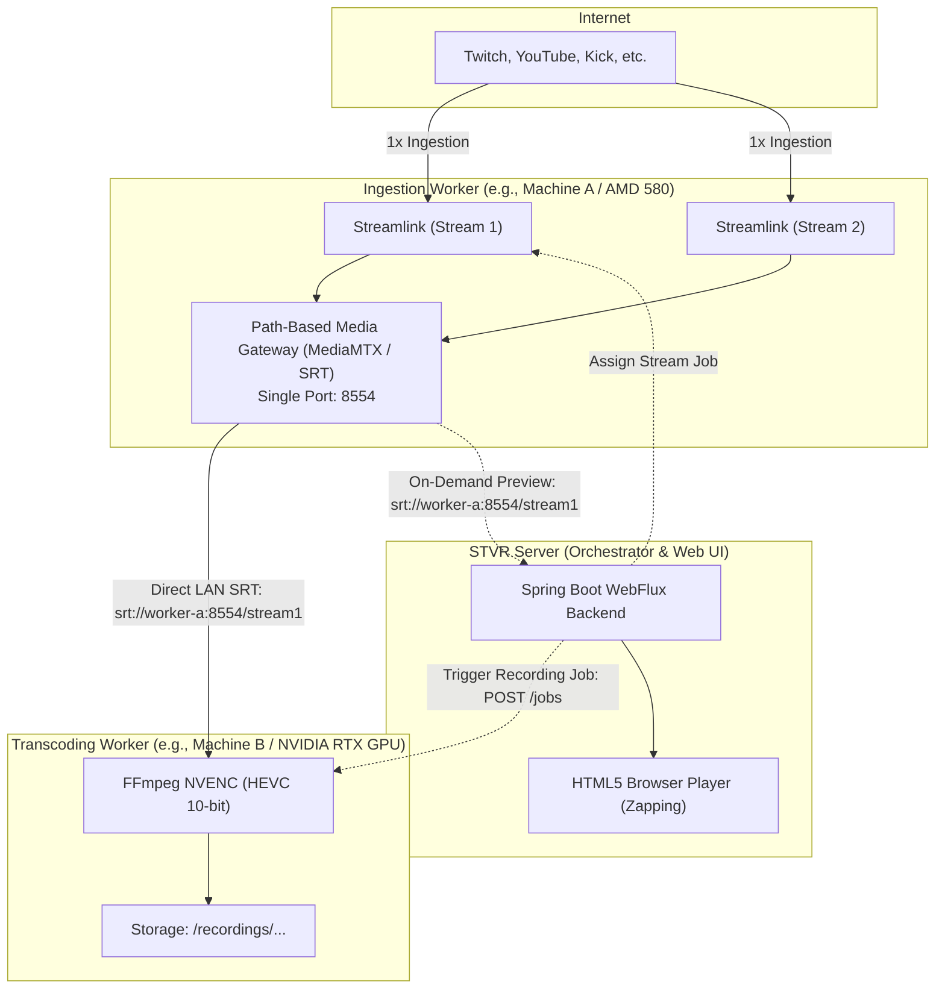
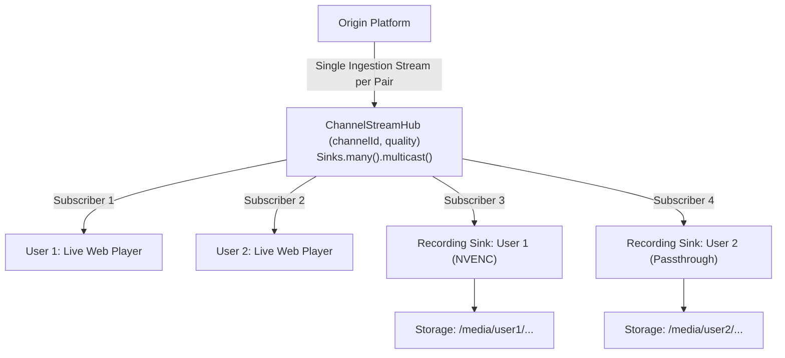
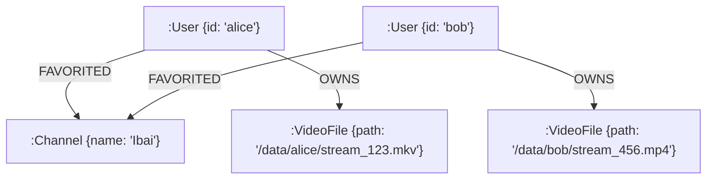
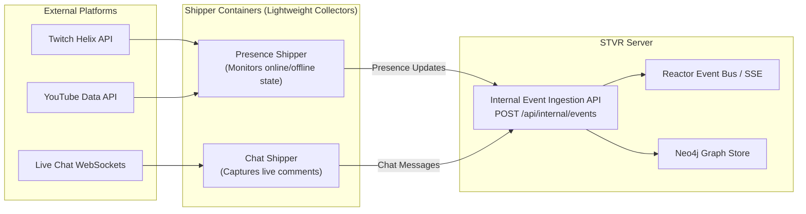
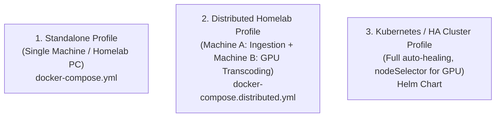

# STVR (Stream Television & Viewer Recorder)
## Comprehensive Architecture & Technical Design Specification

---

## 1. Executive Summary & Vision

**STVR** is a modern, lightweight, self-hosted streaming hub and recorder designed to eliminate the friction of terminal commands and the heavy overhead of bloated, script-saturated streaming websites. 

### Core Mission
1. **Lightweight Channel & Stream Hub:** A comfortable, distraction-free environment to organize favorite streamers and channels across multiple platforms (e.g., Twitch, YouTube, Kick, and custom URLs).
2. **Instant Live Preview & Zapping:** Watch live broadcasts in a native, high-performance HTML5 player with television-like "zapping" (previous/next channel navigation) without loading tracking scripts, ads, or bloated web players.
3. **Pluggable On-Demand Recording:** Seamlessly tap into active streams to record them to disk using customizable FFmpeg profiles (such as GPU-accelerated NVENC or zero-cost passthrough) without duplicating network downloads or interrupting the live preview.
4. **Decoupled Lifecycle:** Background recordings remain completely unaffected when users change channels or close the browser. Reconnecting to a stream being recorded taps back into the ongoing live stream instantly.
5. **Multi-User & Identity Support:** Self-hosted multi-user architecture with personal channel bookmarks, independent personal recordings, and role-based access.

---

## 2. Architectural Principles & Clean Architecture Design

To ensure industrial-grade software engineering, maintainability, and clear separation of concerns, STVR adopts **Domain-Driven Design (DDD)** and **Hexagonal / Clean Architecture** principles:

### 2.1 Separation of Concerns
- **Core First:** The system is fundamentally a live streaming hub. Features such as recording, historical media management, and Docker execution are pluggable extensions that do not pollute the core business logic.
- **Pure Domain Models:** Domain entities are pure Java POJOs/Records without any database annotations, ORM tags, or Spring Data imports.
- **Isolated Persistence:** All database-specific models (Neo4j `@Node`, `@Relationship`), repositories, and query logic are strictly contained inside dedicated `persistence` submodules. Mappers (MapStruct) bridge domain models and graph nodes.
- **External Tools as Packages:** Third-party CLI tools and system wrappers (Streamlink, Docker, FFmpeg) live inside a dedicated `packages/` module namespace, completely decoupled from business domain logic.

---

## 3. Hierarchical Multi-Module Architecture

STVR is organized into a hierarchical multi-module Gradle project using the **API / Entities / Persistence / Implementation** quad-module pattern for each bounded context:

```text
stvr/
├── build.gradle                          # Root Gradle configuration, plugin management & versions
├── settings.gradle                       # Module declarations & hierarchy
│
├── core/                                 # Fundamental Bounded Contexts (The Streaming Hub)
│   ├── identity/                         # User accounts, authentication & authorization
│   │   ├── entities/                     # Pure domain models (User, Role, UserPreference)
│   │   ├── api/                          # UserService, SecurityContext, UserDto, Events
│   │   ├── persistence/                  # UserNode, ReactiveUserRepository, MapStruct mappers
│   │   └── implementation/               # UserServiceImpl, Password hashing, JWT/Session
│   │
│   ├── catalog/                          # Channel & platform management
│   │   ├── entities/                     # Pure domain models (Channel, Platform)
│   │   ├── api/                          # Public contracts (ChannelService, ChannelDto, Events)
│   │   ├── persistence/                  # ChannelNode, ReactiveChannelRepository, MapStruct mappers
│   │   └── implementation/               # ChannelServiceImpl (Business use cases)
│   │
│   ├── presence/                         # Live presence & status monitoring (Online / Offline)
│   │   ├── entities/                     # Pure presence status models
│   │   ├── api/                          # PlatformStatusProvider (SPI), ChannelStatusChangedEvent
│   │   ├── persistence/                  # Historical presence records & queries
│   │   └── implementation/               # LivePresenceHubImpl, Platform-specific status providers
│   │
│   └── streaming/                        # Live stream ingestion & in-memory distribution
│       ├── entities/                     # StreamSession, StreamQuality, StreamBuffer
│       ├── api/                          # StreamPipeline, StreamHub, StreamSink interfaces
│       ├── persistence/                  # Active session persistence (if required)
│       └── implementation/               # ChannelStreamHubImpl, Reactive multicast engine
│
├── packages/                             # Technical adapters & external CLI/tool wrappers
│   ├── streamlink/                       # Streamlink process runner & CLI argument builder
│   ├── docker/                           # Docker CLI adapter (Local socket or remote via --host)
│   └── ffmpeg/                           # FFmpeg process orchestrator & hot-reload profiles
│
├── features/                             # Pluggable extended functionalities
│   ├── recorder/                         # Background & on-demand recording engine
│   │   ├── entities/                     # Pure models: RecordingSession, RecordingProfile
│   │   ├── api/                          # RecorderService, RecordingSessionDto
│   │   ├── persistence/                  # RecordingNode, ReactiveRecordingRepository, Mappers
│   │   └── implementation/               # FfmpegRecorderSink (taps into core:streaming:api)
│   │
│   └── media/                            # Recorded video archive & Byte-Range HTTP streaming
│       ├── entities/                     # Pure models: MediaItem, VideoMetadata
│       ├── api/                          # MediaStorageService, VideoStreamRange
│       ├── persistence/                  # MediaFileNode, ReactiveMediaRepository, Mappers
│       └── implementation/               # MediaStorageServiceImpl, HTTP 206 Partial Content server
│
└── server/                               # Executable Spring Boot application & Web UI
    ├── src/main/java/                    # REST WebFlux Controllers, SSE Endpoints, Security/CORS
    └── src/main/resources/static/        # Modern Web UI (Dark theme, Channel Sidebar, Zapping Player)
```

---

## 4. Distributed Multi-Node Topology & Stream Transport

STVR natively supports distributed heterogeneous hardware setups (e.g., dedicated ingestion machines capturing streams and dedicated GPU nodes for transcoding):



### 4.1 Key Architecture Points:
1. **Zero Server Network Tromboning:** The dedicated GPU worker pulls video bytes **directly from the ingestion worker** via high-performance SRT over the LAN (`srt://worker-a:8554/stream1`). The STVR Server orchestrates the recording via lightweight REST/control signals and never re-transmits heavy recording bytes.
2. **Single-Port Multiplexing for N Streams:** Ingestion workers run a lightweight path-based media gateway (e.g., MediaMTX, <15MB RAM). A single exposed port (`8554`) handles $N$ concurrent streams via URI paths (`/stream1`, `/stream2`), eliminating dynamic port exposure chaos.
3. **Hardware Specialization:** Ingestion machines with standard or non-NVENC hardware (e.g., AMD RX 580) focus 100% of their CPU and network on stream capture, while the dedicated NVIDIA machine (e.g., RTX 3070 Ti) concentrates exclusively on high-efficiency NVENC HEVC transcoding.
4. **Standalone Local Fallback:** On a single-machine deployment, all components bind to `localhost:8554` over loopback, retaining the exact same codebase and zero network card overhead.

---

## 5. Reactive Multicast Pipeline: The (Stream, Quality) Ingestion Pair

To maintain zero duplicate network ingestion while avoiding complex transcoding conflicts between users, active streams are managed via the tuple **`(channelId, quality)`**:



### 5.1 Ingestion & Multicast Rules:
1. **Shared Stream Hub:** If User 1 and User 2 watch `(Channel A, 720p)`, both subscribe to the exact same `ChannelStreamHub(Channel A, 720p)` in memory. The origin server receives only 1 connection.
2. **Quality Isolation:** If User 3 specifically requests `(Channel A, 1080p)`, a separate hub is created for `(Channel A, 1080p)`, honoring their explicit preference cleanly without cross-user interference.
3. **Independent Recording Taps:** Multiple users can record the same stream with their own desired FFmpeg profile and start/stop timestamps. Each user's recording sink writes to their own dedicated output file.

---

## 6. Persistence & User-Owned Media Model (Neo4j)

### 6.1 Graph Schema
Relationships in Neo4j remain direct and cleanly isolated per user:



### 6.2 Direct Ownership & Simple Deletion Lifecycle
- **Strict 1-to-1 Ownership:** Every recording belongs strictly to the user who initiated it: `(User)-[:OWNS]->(VideoFile)`.
- **Direct Deletion:** When a user deletes one of their recorded videos:
  1. The physical file is removed from disk (`Files.deleteIfExists(path)`).
  2. The `VideoFile` node and its relationships are deleted from Neo4j.
- **Sharing as Future Scope:** Social or inter-user media sharing is deliberately separated and deferred as an optional future enhancement, avoiding premature complexity.

---

## 7. Execution Modes & Tool Integration (`packages/`)

### 7.1 Streamlink Runner & Inspector (`packages:streamlink` & `packages:docker`)
Streamlink execution is decoupled using the Strategy pattern:
- **`StreamlinkInspector` (`--json`):** Queries `streamlink --json <url>` to automatically detect supported platforms (from `plugin`), extract channel metadata (`author`, `title`), and check live presence & available qualities.
- **`NativeStreamlinkRunner`:** Directly invokes the host `streamlink` binary from system `PATH`. Universal for standard installations.
- **`DockerStreamlinkRunner`:** Invokes `docker [--host <remote_host>] exec -i <container_name> streamlink ...` (targeting the `streamlink` container). Supports local Docker daemons or remote Docker endpoints via `--host` / `DOCKER_HOST`.

### 7.2 FFmpeg & Hot-Reload Profiles (`packages:ffmpeg`)
Recordings are transcoded/muxed via FFmpeg without server restarts:
- **`passthrough` (Default):** `-c copy -f matroska`. Zero CPU/GPU encoding cost.
- **`nvenc-gpu` (NVIDIA GPUs):** `scale_cuda`, `hevc_nvenc`, `main10`, `cq 31`, `p6`. Ultra-high quality hardware encoding.
- **`cpu-h264`:** `libx264 -preset veryfast -crf 23`. Universal software encoding.
- **`custom`:** Dynamic parameter string editable directly via API / Web UI.

---

## 8. External API Collectors & Event Shippers

To handle external platform polling, live chat capture, and presence monitoring without blocking or polluting the main server, STVR adopts the **Data Shipper / Collector Pattern** (analogous to *Beats / Elastic Agents*):



### 8.1 Advantages of the Shipper Pattern:
1. **Rate-Limit & IP Fault Isolation:** If an external platform throttles or bans an IP address due to frequent polling, only that isolated collector container is affected; the STVR server and active video streams remain 100% operational.
2. **Minimal Footprint:** Shippers are tiny asynchronous processes (Go, Python async, or Node.js, ~15-20MB RAM) that only handle text and HTTP polling.
3. **Independent Scaling:** Chat collectors can scale horizontally per active stream without requiring changes to the central Spring Boot server.

---

## 9. Automated Deployment Profiles & Orchestration

STVR supports diverse deployment scales through pre-configured **Deployment Profiles**:



### 9.1 Profiles Breakdown:
- **Profile `standalone` (Default for GitHub / Local Testing):**
  - Single `docker-compose.yml` deploying `stvr-server`, `neo4j`, and local `streamlink`.
  - All communication binds to internal Docker bridge or `localhost`.
- **Profile `distributed-homelab` (Multi-Machine Hardware Specialization):**
  - **Machine A (Ingestion - AMD 580):** `docker-compose.ingest.yml` (Streamlink + MediaMTX SRT on port `8554`).
  - **Machine B (Transcoding - RTX 3070 Ti):** `docker-compose.transcode.yml` (FFmpeg worker with NVIDIA container runtime).
  - **Machine C (or B):** `docker-compose.server.yml` (STVR Server + Neo4j).
  - Coordinated via environment variables:
    ```env
    STVR_INGEST_NODE_URL=srt://192.168.1.100:8554
    STVR_GPU_WORKER_URL=http://192.168.1.101:9090
    ```
- **Profile `k8s-cluster` (Enterprise / Kubernetes):**
  - Helm chart with dedicated Pod specs.
  - Transcoding pods assigned via node affinity: `nodeSelector: { "nvidia.com/gpu": "true" }`.
  - Ingestion pods running as lightweight scalable Workers.

---

## 10. Technology Stack & Key Dependencies

| Technology | Role / Purpose | Module Location |
| :--- | :--- | :--- |
| **Java 17 (OpenJDK)** | Core language runtime (LTS) | All modules |
| **Gradle 9.x (Groovy DSL)** | Multi-module build automation & dependency management | Root (`build.gradle`, `settings.gradle`) |
| **Spring Boot 3.x (WebFlux)** | Reactive, non-blocking web framework, Netty server, REST & SSE | `server`, `api`, `implementation` |
| **Project Reactor** | Reactive programming model (`Mono`, `Flux`, `Sinks.many().multicast()`) | `core:*`, `features:*`, `server` |
| **Spring Data Neo4j (SDN)** | Reactive graph object mapping (`ReactiveNeo4jRepository`) | `*:persistence` modules |
| **Neo4j Java Driver** | High-performance Bolt protocol connection to Neo4j | `*:persistence`, `server` |
| **MapStruct** | Compile-time, type-safe mapping between Domain Models and Graph Nodes | `*:persistence` modules |
| **Project Lombok** | Boilerplate reduction (getters, builders, constructors, slf4j) | Compile-only across all modules |
| **Jackson (JSR310)** | Non-blocking JSON serialization/deserialization | `api`, `server` |
| **MediaMTX / SRT Protocol** | Path-based single-port media gateway for N concurrent streams | Ingestion Workers |
| **Streamlink CLI** | Origin media stream resolution and packet extraction | `packages:streamlink`, `packages:docker` |
| **FFmpeg** | Video encoding, hardware acceleration (NVENC/CUDA) & container packaging | `packages:ffmpeg` |
| **Modern Frontend (Vanilla Web)** | Reactive HTML5 video player, Server-Sent Events listener, Dark UI | `server/src/main/resources/static` |

---

## 11. Summary of Development Workflow & Roadmap

1. **Gradle Multi-Module Foundation:** Setup `settings.gradle`, shared plugins in `build.gradle`, and module skeletons.
2. **Core Domain & Persistence:** Define pure records in `entities`, MapStruct mappers and Neo4j repositories in `persistence`.
3. **Reactive Stream Engine:** Implement `ChannelStreamHub`, multicast sinks, and Streamlink CLI adapters.
4. **Presence & Catalog:** Implement channel management and platform status providers.
5. **Pluggable Recorder:** Implement FFmpeg recording sink and dynamic tap.
6. **Web Server & UI:** Implement WebFlux controllers, SSE feeds, and the modern television-style zapping interface.
