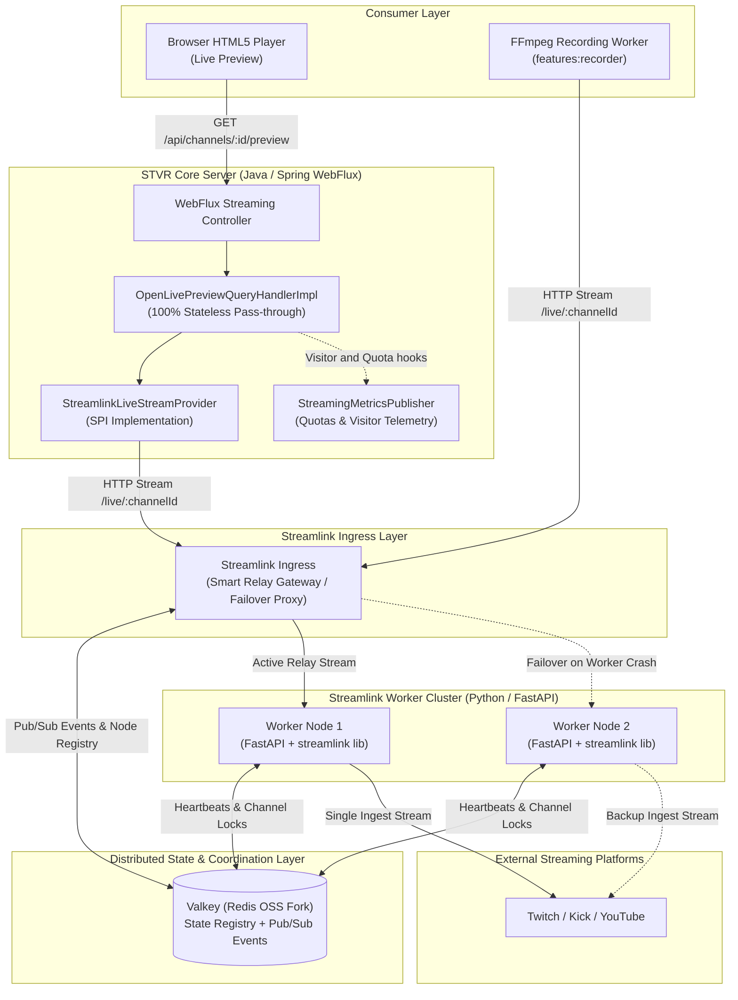

# STVR Streaming Ingestion Cluster & Reactive Media Gateway
## Architecture Specification, Use Cases & Architecture Decision Records (ADRs)

---

## 1. Executive Summary & Overview

This specification establishes the architecture, component boundaries, distributed topology, use cases, and Architecture Decision Records (ADRs) for the **STVR Streaming Ingestion and Live Preview System**.

The streaming subsystem is designed around three non-negotiable principles:
1. **100% Stateless Application Server:** The STVR Server (Java/Spring Boot) maintains zero stream buffering or session state in JVM RAM, allowing linear horizontal scaling.
2. **Single Ingest per Channel:** Regardless of how many clients (live previews or background recorders) consume an active channel, the system establishes **at most one** upstream connection to the origin platform (Twitch, Kick, YouTube, etc.) to prevent duplicate bandwidth and IP rate-limiting.
3. **Transparent Resilience & Decoupled Lifecycles:** Viewers opening or closing live previews have zero impact on ongoing disk recordings. Temporary worker crashes are transparently recovered by the gateway without breaking active client streams.

---

## 2. Distributed Architecture & Component Responsibilities

### 2.1 STVR Core Server (`core:streaming`)
- **Role:** Pure reactive streaming pass-through and domain gateway.
- **Statefulness:** **100% Stateless**. Holds no in-memory registries, multicast sinks, or process handles.
- **Responsibilities:**
  - Evaluates `OpenLivePreviewQuery(channelId, url, quality, userId)`.
  - Dispatches to registered `LiveStreamProvider` SPI implementations.
  - Wires reactive lifecycle hooks (`doOnSubscribe`, `doOnNext`, `doFinally`) into `StreamingMetricsPublisher` for real-time visitor concurrency and bandwidth quota accounting.
  - Streams byte chunks directly into the HTTP response; cancels the upstream subscription automatically upon client socket termination.

### 2.2 Streamlink Ingress (Smart Relay Gateway)
- **Role:** High-availability reverse proxy and resilient media relay.
- **Responsibilities:**
  - Exposes unified endpoint: `GET /live/{channel_id}?url=...&quality=...`.
  - Hides worker cluster topology from the STVR Server and FFmpeg workers.
  - Queries Valkey to check if an active worker node is already ingesting the target channel.
  - If unassigned, acquires a distributed lock in Valkey and delegates ingestion to the least-loaded worker node.
  - Multiplexes the worker's byte stream to concurrent ingress consumers.
  - **Transparent Failover:** If the assigned worker crashes mid-stream, the Ingress detects the socket break, allocates a backup worker via Valkey, resumes the stream from origin, and stitches it back to the client connection without terminating the client HTTP stream.

### 2.3 Streamlink Worker Nodes (Python / FastAPI)
- **Role:** Native media extraction engines.
- **Responsibilities:**
  - Built as lightweight Python containers running FastAPI.
  - Utilizes the Python `streamlink` library directly (`import streamlink`) rather than spawning operating system CLI processes.
  - Manages active streams in an internal asyncio broadcast registry.
  - Emits real-time heartbeats and stream lifecycle signals (`STARTED`, `STALLED`, `ENDED`) to Valkey Pub/Sub.
  - Tears down the origin platform connection when all local consumers disconnect.

### 2.4 Valkey (Open-Source Distributed State & Pub/Sub)
- **Role:** Sub-millisecond distributed coordination and reactive messaging.
- **Responsibilities:**
  - **Node Registry & Heartbeats:** `node:{node_id} -> {host, active_streams}` with short TTL (e.g., 10s).
  - **Channel-to-Worker Mapping:** `channel:{channel_id} -> {node_id, quality}` with periodic keep-alive.
  - **Atomic Locks:** `SET channel:{channel_id} node_id NX EX 30` ensuring single-ingest per channel across the entire cluster.
  - **Reactive Pub/Sub Bus:** Broadcasts `stream:events` to notify Ingress and workers of stream state changes instantaneously.

---

## 3. Use Cases Specification

### UC-STR-01: Open Live Preview Stream
- **Actor:** Authenticated User / Client Web Player.
- **Inputs:** `channelId: ChannelId`, `url: ChannelUrl`, `quality: StreamQuality`, `userId: UserId?`.
- **Primary Flow:**
  1. Client sends `GET /api/channels/{channelId}/preview` to STVR Server.
  2. STVR Controller dispatches `OpenLivePreviewQuery` to `OpenLivePreviewQueryHandler`.
  3. Handler locates supporting `LiveStreamProvider` SPI for `url` (e.g. `StreamlinkLiveStreamProvider`).
  4. Provider requests `GET http://streamlink-ingress:8000/live/{channelId}?url={url}&quality={quality}`.
  5. Ingress checks Valkey:
     - **If already active on a worker:** Ingress taps into the ongoing stream relay.
     - **If inactive:** Ingress assigns an idle worker, which calls `streamlink.open()` on the origin platform.
  6. Bytes begin streaming through Ingress -> STVR Server -> Web Player.
  7. Reactor pipeline triggers `StreamingMetricsPublisher.emitVisitorIncreaseMetric(channelId, userId)`.
  8. Streaming continues reactively, emitting `StreamingMetricsPublisher.emitQuotaMetric(channelId, userId, bytes)` as chunks flow.
- **Error Cases:**
  - Origin stream offline/unavailable -> throws `StreamUnavailableException` reactively.
  - Ingress unreachable -> maps to `StreamUnavailableException(503 Service Unavailable)`.

---

### UC-STR-02: Client Disconnect & Stream Teardown
- **Actor:** Client Web Player / Network Environment.
- **Trigger:** User closes browser tab, navigates away, or loses network connection.
- **Primary Flow:**
  1. Client aborts the HTTP request / closes TCP socket.
  2. Spring WebFlux detects subscriber cancellation on the `Flux<byte[]>`.
  3. Reactive operator `doFinally(signalType)` triggers deterministically:
     - Invokes `StreamingMetricsPublisher.emitVisitorDecreaseMetric(channelId, userId)`.
     - Calls `LiveStreamConnection.cancel()`, closing the HTTP connection to the Ingress.
  4. Ingress detects consumer detachment:
     - If other consumers (another preview viewer or FFmpeg recorder) remain connected to Ingress for this channel: Ingress keeps worker stream alive.
     - If total consumers for this channel reach 0: Ingress notifies the worker / releases the lock in Valkey.
     - Worker closes the `streamlink` file descriptor and releases origin platform bandwidth.

---

### UC-STR-03: Single Ingest / Deduplicated Multicast
- **Actors:** Viewer A (Live Preview), Viewer B (Live Preview), FFmpeg (Recorder).
- **Trigger:** Multiple consumers request the same `channelId` concurrently or successively.
- **Primary Flow:**
  1. First consumer requests channel -> Ingress claims channel lock in Valkey and starts worker ingest.
  2. Origin platform (Twitch/YouTube) is connected **once**.
  3. Second and third consumers connect to Ingress for the same channel.
  4. Ingress attaches them to the existing local broadcast queue without opening new origin connections.
  5. Origin bandwidth consumption remains strictly $1\times$.

---

### UC-STR-04: Transparent Worker Failover
- **Trigger:** Worker container running `streamlink` crashes, restarts, or runs out of memory.
- **Primary Flow:**
  1. Ingress detects socket closure/reset on the internal worker connection.
  2. Ingress checks Valkey for available healthy worker nodes (filtered by active heartbeat).
  3. Ingress updates channel mapping in Valkey and initiates `open()` on the backup worker node.
  4. Backup worker connects to origin and streams chunks to Ingress.
  5. Ingress pipes the new chunk stream into the ongoing client response pipeline.
  6. **Invariant:** The STVR Server and FFmpeg recorder experience no socket termination and require no retry logic.

---

### UC-STR-05: Concurrent Stream Recording & Independent Teardown
- **Actors:** User A (watching Live Preview), Background Scheduler (running FFmpeg recording).
- **Primary Flow:**
  1. Scheduler executes `StartRecordingCommand` -> FFmpeg connects to `http://streamlink-ingress:8000/live/{channelId}` and writes to `/recordings/stream.mp4`.
  2. User A opens live preview -> STVR connects to same Ingress URL and streams to browser.
  3. User A closes the browser tab -> STVR triggers `doFinally`, cancelling preview connection.
  4. Ingress notes that FFmpeg recorder is still actively reading -> **Worker stream remains 100% active**.
  5. FFmpeg continues recording uninterrupted with zero dropped frames.
  6. User A re-opens preview 10 minutes later -> STVR reconnects to Ingress and joins ongoing stream immediately with zero origin duplication.

---

### UC-STR-06: Telemetry & Quota Accounting
- **Trigger:** Byte chunks transferred through STVR Server.
- **Primary Flow:**
  1. During active streaming, `OpenLivePreviewQueryHandlerImpl` executes `doOnNext(chunk -> metricsPublisher.emitQuotaMetric(channelId, userId, chunk.length))`.
  2. Implementations of `StreamingMetricsPublisher` accumulate transferred bytes per user/channel in Prometheus gauges or Redis rate-limiters.
  3. If a channel or user exceeds daily bandwidth allocation, future `OpenLivePreviewQuery` requests can be rejected with `QuotaExceededException`.

---

## 4. Architecture Decision Records (ADRs)

### ADR-001: 100% Stateless STVR Server (Elimination of In-Memory Stream Hubs)
* **Status:** Accepted
* **Context:**
  Earlier iterations contained `ChannelStreamHub` and `StreamHubRegistry`, which stored active streaming sinks (`Sinks.Many<byte[]>`) in a `ConcurrentHashMap` in the JVM heap.
* **Problem:**
  Running multiple STVR instances behind a load balancer broke horizontal scaling: Instance 2 could not see streams managed by Instance 1, leading to duplicate upstream connections, memory bloat on the JVM, and failed cross-instance stream commands.
* **Decision:**
  Remove `ChannelStreamHub` and `StreamHubRegistry` entirely from STVR. The STVR Server acts as a pure stateless reactive pass-through. Multicasting and stream state management are delegated downstream to the Streamlink Ingress layer.
* **Consequences:**
  - STVR instances require zero inter-node communication for streaming.
  - Zero JVM memory pressure from buffering high-bitrate video byte chunks.
  - Linear horizontal scalability for STVR Server nodes.

---

### ADR-002: Zero Server Network Tromboning (Independent Preview & Recording)
* **Status:** Accepted
* **Context:**
  The system supports both real-time user preview and long-running disk recording via FFmpeg.
* **Problem:**
  Routing multi-gigabyte recording streams through the STVR Server JVM heap ("network tromboning") causes garbage collection spikes, high CPU usage, and tightly couples disk recording to the user's web session.
* **Decision:**
  FFmpeg workers and the STVR Server connect as independent, direct HTTP clients to the Streamlink Ingress. Video bytes intended for recording bypass the STVR JVM completely and write straight from Ingress to disk.
* **Consequences:**
  - Closing a browser preview has zero side-effects on background recordings.
  - STVR Server restarts or deployments do not disrupt active recordings.
  - Massively reduced network and memory overhead on the STVR application layer.

---

### ADR-003: Unified Reactive Stream Lifecycle via `doFinally` (Removal of Explicit Close Command)
* **Status:** Accepted
* **Context:**
  The API previously specified `CloseLivePreviewCommandHandler` alongside `OpenLivePreviewQueryHandler`.
* **Problem:**
  In real-world web environments, clients disconnect primarily due to tab closures, page navigation, mobile screen locks, or WiFi drops. In none of these cases can the browser reliably execute an explicit `POST /preview/close` HTTP command. Furthermore, executing both explicit commands and socket cancellations caused race conditions and double-decrementing visitor metrics.
* **Decision:**
  Eliminate `CloseLivePreviewCommandHandler`. The entire lifecycle of a live preview session is bound to the reactive `Flux<byte[]>` subscription. Reactor's `doFinally(signalType)` operator is the single source of truth for teardown, metric emissions (`emitVisitorDecreaseMetric`), and resource cancellation.
* **Consequences:**
  - Guaranteed symmetry: exactly one decrease metric per increase metric.
  - Zero race conditions or zombie connections on network dropouts.
  - Frontend code is simplified: aborting the HTTP request cleanly tears down the stream.

---

### ADR-004: Streamlink Ingress as a Resilient Smart Relay Gateway
* **Status:** Accepted
* **Context:**
  To distribute traffic across multiple Streamlink worker nodes, we evaluated HTTP 307 temporary redirects versus an Ingress relay proxy.
* **Problem:**
  HTTP 307 redirects force the client (STVR Server / FFmpeg) to maintain a direct socket with individual worker nodes. If a worker node crashes mid-broadcast, the client experiences a connection drop and must implement complex retry, timeout, and reconnection logic.
* **Decision:**
  Deploy Streamlink Ingress as a Smart Relay Gateway. Clients maintain a single, uninterrupted connection to the Ingress. The Ingress handles worker selection, deduplication, and automatic transparent failover if an upstream worker dies.
* **Consequences:**
  - STVR and FFmpeg code remains trivial, needing zero failover or retry logic.
  - Internal worker topology and IP addresses remain hidden behind the gateway.
  - Workers can be scaled or updated dynamically without disrupting active consumers.

---

### ADR-005: Native Python `streamlink` Library in FastAPI vs. OS CLI Subprocesses
* **Status:** Accepted
* **Context:**
  Streamlink can be invoked either via its command-line binary (`streamlink <url> <quality>`) or as an imported Python library (`import streamlink`).
* **Problem:**
  Spawning OS CLI subprocesses (`subprocess.Popen`) introduces operating system process management headaches: tracking PIDs, handling zombie processes upon ungraceful container shutdown, escaping complex shell arguments, and capturing blocking I/O pipes.
* **Decision:**
  Build Streamlink worker nodes as Python FastAPI microservices using the native Python `streamlink` library. Stream acquisition is handled directly via `session.streams(url)['best'].open()` and streamed asynchronously with `StreamingResponse`.
* **Consequences:**
  - Complete elimination of OS CLI process leaks, PID tracking, and signal handling.
  - Direct async I/O integration with FastAPI's event loop.
  - Clean in-process exception handling for platform errors (geo-blocks, ads, stream offline).

---

### ADR-006: Valkey as Distributed State Store and Reactive Pub/Sub Event Bus
* **Status:** Accepted
* **Context:**
  The worker cluster requires shared state for channel allocation, node heartbeats, and real-time event notifications.
* **Problem:**
  Relational databases introduce excessive latency and polling overhead in the real-time streaming path. Following Redis's license change in 2024, using Redis directly conflicts with open-source licensing principles.
* **Decision:**
  Adopt **Valkey** (the Linux Foundation's official BSD-3-clause open-source fork of Redis) as the shared in-memory state store and event bus. Valkey manages:
  1. Atomic locks (`SET channel:{id} node NX EX 30`) for single-ingest guarantees.
  2. Ephemeral node heartbeats (`node:{id}`) with TTL.
  3. Real-time event broadcasting (`PUBLISH stream:events`) for reactive stream state transitions.
* **Consequences:**
  - 100% open-source compliance under BSD-3.
  - Sub-millisecond state coordination without database polling.
  - Zero zombie channel registrations due to automatic TTL expiration.

---

### ADR-007: Pluggable Metrics & Quotas Port (`StreamingMetricsPublisher`)
* **Status:** Accepted
* **Context:**
  STVR requires visibility into concurrent viewers per channel, total bandwidth consumed, and user quota tracking.
* **Problem:**
  Hardcoding metric collection or coupling `core:streaming` directly to Prometheus, Redis, or billing databases creates architectural bloat and prevents lightweight local testing.
* **Decision:**
  Introduce the `StreamingMetricsPublisher` SPI port in `core:streaming:api` with hooks:
  - `emitVisitorIncreaseMetric(ChannelId, UserId)`
  - `emitVisitorDecreaseMetric(ChannelId, UserId)`
  - `emitQuotaMetric(ChannelId, UserId, bytes)`
  Provide a default `NoOpStreamingMetricsPublisher` in `core:streaming:implementation`.
* **Consequences:**
  - Hexagonal purity: telemetries and quotas are decoupled from stream transport.
  - Clean integration with Prometheus, domain event buses, or quota managers.
  - Unit tests run out-of-the-box without requiring metric infrastructure.

---

### ADR-008: Contextual Query Tuple (`ChannelId` for Domain Observability + `ChannelUrl` for Transport)
* **Status:** Accepted
* **Context:**
  `OpenLivePreviewQuery` accepts both `ChannelId` and `ChannelUrl`.
* **Problem:**
  Passing both appeared redundant, as `ChannelUrl` can theoretically be resolved from `ChannelId`.
* **Decision:**
  Formally adopt the **Contextual Query Pattern**:
  - `ChannelId`: Represents the canonical domain identity in STVR. Used for metrics, concurrent viewer counting, user quotas, and audit logging.
  - `ChannelUrl`: Represents the volatile technical transport address. Handed directly to `LiveStreamProvider` plugins to avoid querying the `core:catalog` database.
* **Consequences:**
  - Zero cross-context database lookups inside `core:streaming`.
  - Stable metrics tracking even if streamer handles or URLs change in the future.
  - Explicit, self-contained query parameters.
